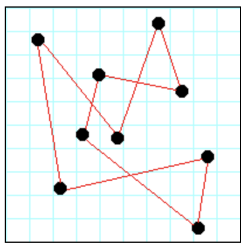

# Traveling Salesman

This project considers the travelling salesman problem.

## Purposes of this assignment

- To gain further experience with *Test-Driven-Development* (TDD).
- To give you more practice with writing tests.
- To get you started thinking about how to solve problems with programs.
- To give you further practice using the Travis Continuous Integration (CI) process.
- To make you consider different search algorithms and data structures.

## General idea of the assignment

Suppose there are a number of "cities", as in shown in Figure 1 below:

The distance between any two cities is the standard Euclidean distance, that is, 

√((x1-x2)2+(y1-y2)2)

A traveling salesman wishes to visit every city exactly once, 
then return to their starting point. (It doesn't matter what city is 
the starting point.) Such a path is called a *circuit*, 
as in Figure 2 below:

However, the salesman also wishes to minimise the total distance that 
must be traveled.

This is a classic computer science problem, known as the 
**Traveling Salesman problem**. You can find algorithms for 
finding reasonably good solutions on the web, and you are welcome to look 
at those algorithms. However, we want you use a *hill climbing& approach, 
where you start with "any" solution, and try to progressively improve 
it until you can't improve it any more.

This should require you to think about how to solve the problem, 
rather than just copying some algorithm you may or may not understand. 
Your final solution is unlikely to be the *optimal* 
(best possible) solution, but that's okay, so long as it isn't 
obviously terrible.
